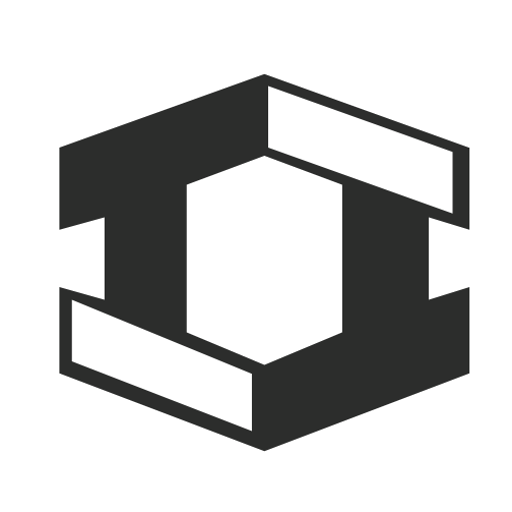
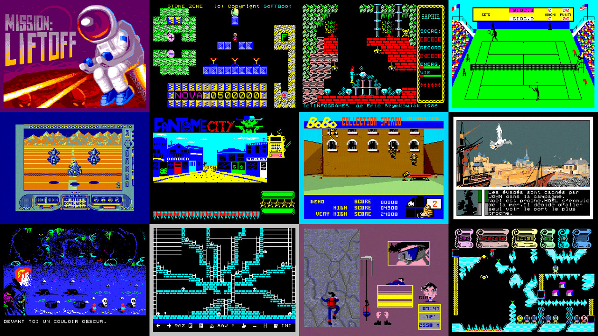

# Thomson - MO/TO (Theodore)

### Description

Theodore is an emulator for Thomson MO/TO computers.

Thomson MO/TO is a family of 8-bit home computers produced by French company Thomson SA between 1982 and 1989.

### License

GPLv3

### Icon

### Fanart

Help make me fanart!

### Screenshots

